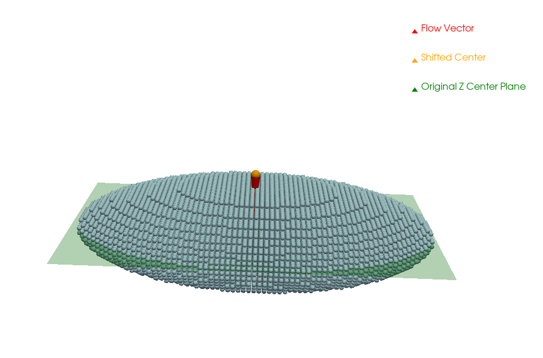
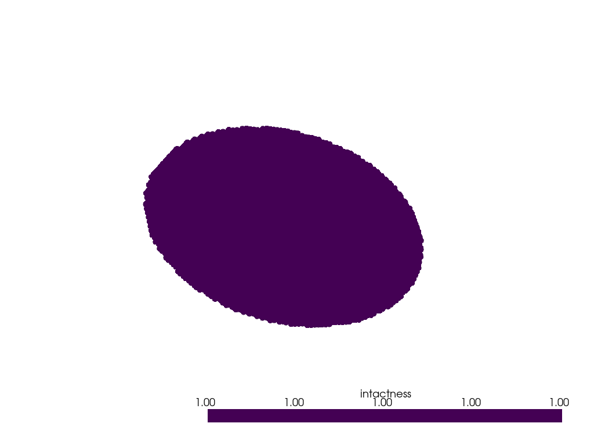
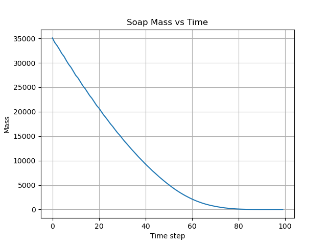
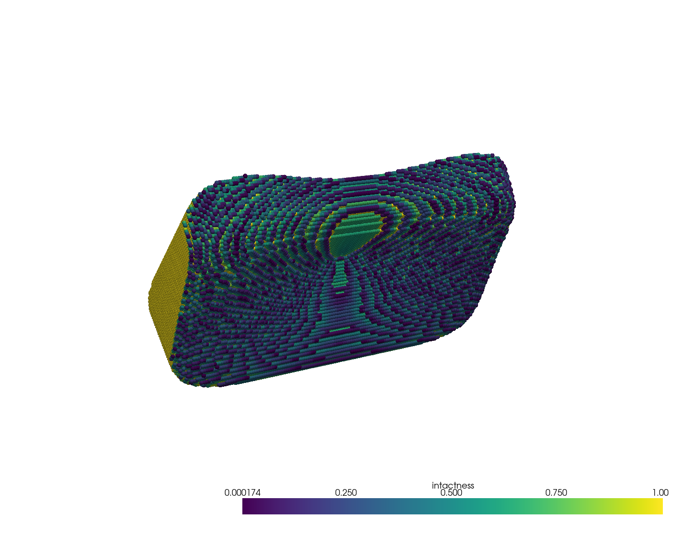
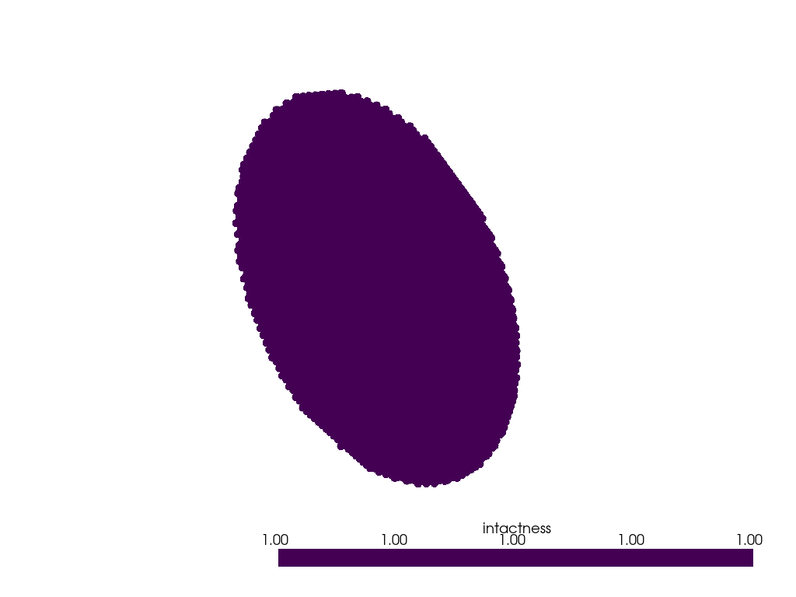
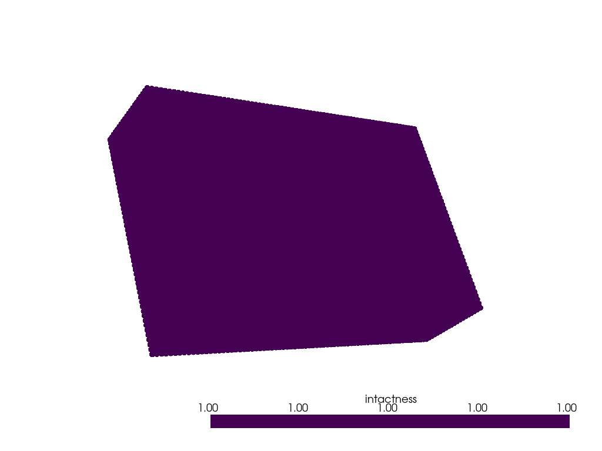
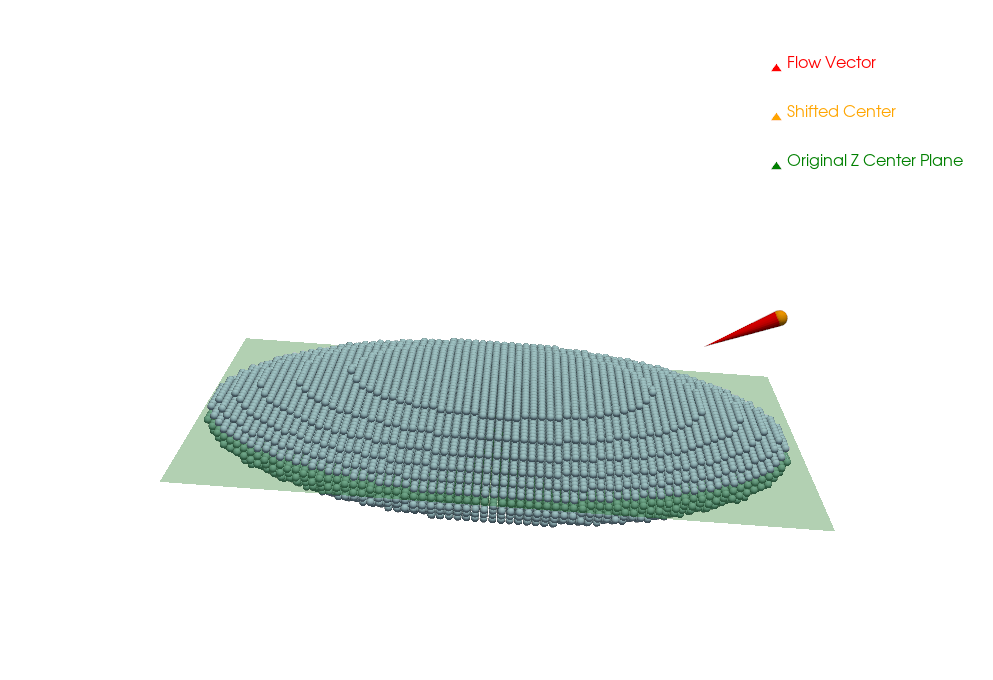

---

## 🧼 Bar Soap in Shower Simulation

**A physics-inspired erosion simulation of a soap bar under shower flow**, using voxel geometry, customizable water behavior, and PyVista visualization. Designed to reflect the deterministic and stochastic principles used in nuclear reactor modeling.

> 🔬 *“It’s like CRUD modeling for soap.”*

---

### 📸 Project Overview

| Geometry (Ellipsoid)                                  | Erosion in Action                             |
| ----------------------------------------------------- | --------------------------------------------- |
|  |  |

*Left: Debug rendering of voxelized ellipsoid geometry. Right: Directional erosion from above.*

---

### 💡 Simulation Concepts

Each timestep simulates water interacting with the soap bar's surface. Erosion depends on:

* **Flow vector**: the direction of water (e.g., `[0, 0, -1]` for top-down)
* **Erosion rate**: how much material is lost per timestep
* **Stochastic/deterministic**: should erosion be smooth or noisy?
* **Geometry**: ellipsoid, cuboid, rounded edges, etc.
* **Voxel model**: just like reactor lattice meshing

> Inspired by lattice-based models in **OpenMC**, **RELAP5**, and CRUD buildup tracking in real reactors.

---

### 📁 Folder Structure

```
soap_tub_simulation/
├── main.py                      # Entrypoint: runs the simulation
├── parameters.yaml              # Change geometry, flow, erosion mode here
├── core_geometry/
│   └── voxel_model.py           # Holds 3D soap structure & surface logic
|   └── shape_generator.py       # Creates different soap shapes
├── physics_models/
│   ├── deterministic_erosion.py
│   ├── stochastic_erosion.py
│   └── vector_utils.py         # Shared vector logic (flow projection, center)
├── simulation_engine/
│   └── time_integrator.py      # Simulation loop + mass tracking
├── visualization/
│   ├── animate.py              # Renders erosion over time
│   ├── render_voxel.py
│   └── debug_overlay.py        # Flow vector + soap overlay for debugging
├── analysis_tools/
│   └── erosion_map.py
│   └── mass_tracker.py
├── assets/
│   └── [generated images/gifs]
└── README.md
```

---

### ⚙️ Key Inputs: `parameters.yaml`

```yaml
soap:
  size: [50, 75, 15]
  voxel_resolution: 1.0
  geometry: ellipsoid

simulation:
  steps: 100
  log_interval: 10

erosion_model:
  type: deterministic      # Options: deterministic, stochastic
  flow_vector: [0, 0, -1]  # Top-down shower flow
  erosion_rate: 0.5        # mm^3 per step per exposed voxel
  water_source_height: 10.0

  # For stochastic model:
  erosion_std: 0.1
  erosion_fraction: 0.95   # fraction of the surface voxels that are eroded at each timestep.
  seed: 43
```

> Try changing `geometry` to `cuboid`, `rounded_cuboid`, or `cylinder`.
> Or test `stochastic` erosion for a messier, realistic result.

---

### 🎞️ Visualizations

|Soap Mass vs Time | Deterministic Rounded Cuboid Off Axis Snapshot  |
| ----------------------------------------------------- | --------------------------------------------- |
| **Stochastic Ellipsoid Side Erosion** | **Deterministic Rounded Cuboid Off Axis**  |
|**Stochastic Cuboid Erosion**  | **Stochastic Cuboid Erosion From Corner Angle** 


---

### 🔬 Deterministic vs. Stochastic Erosion

| Type              | Behavior                                | Use Case                     |
| ----------------- | --------------------------------------- | ---------------------------- |
| **Deterministic** | Smooth, physics-based vector projection | Like laminar flow on CRUD    |
| **Stochastic**    | Random subset + noise                   | Captures chaotic splashiness |

---

### 🧠 How It Works

* **Voxel model** tracks soap as a 3D grid: `grid[x, y, z] ∈ [0, 1]`
* **Flow vector** sets direction; center is projected *upstream*
* **Surface detection** uses binary erosion to find outer shell
* **Exposure** is computed via vector dot product: `dot(normal, flow_vector)`
* **Erosion engine** subtracts value from each voxel over time
* **Visualization** uses PyVista to animate voxel decay

---

### 🖥️ Running Locally

#### ✅ 1. Install Dependencies

Make sure you have **Python ≥ 3.8**. Then run:

```bash
conda create -n soap_sim python=3.10
conda activate soap_sim

conda install numpy scipy matplotlib pyyaml -y
conda install -c conda-forge pyvista vtk -y
```

#### ✅ 2. Run Simulation

```bash
python main.py
```

It will:

* Print mass loss at intervals
* Save snapshots of the voxel model
* Show debug render
* Show render of remaining soap (if any remains)
* Generate a `.gif` in `gifs/`

---

### 🧪 Experiments to Try

1. **Compare geometries**: Rounded cuboids erode slower at corners.
2. **Turn up `erosion_rate`** to simulate jet spray.
3. **Use off-axis vectors** like `[1, 1, -1]` and see the erosion cone.
4. **Switch to stochastic** with `erosion_fraction=0.95` and `mean=0.5`.

---

### 🔍 Debugging View (Vector Projections)



Shows:

* 🔴 Flow vector
* 🟧 Shifted center (upstream origin)
* 🟢 Original soap center
* Shaded plane = center slice for visual reference

---

### 🧠 Related Concepts in Nuclear Engineering

| This Simulation      | Reactor Analogy                 |
| -------------------- | ------------------------------- |
| Voxel grid           | Pin-cell lattice (OpenMC)       |
| Erosion model        | Thermal flux / CRUD solver      |
| Mass tracking        | Depletion solver (e.g., ORIGEN) |
| Flow vector          | Coolant velocity field          |
| Exposure dot product | Angular flux projection         |

---

### 🧼 Made For Engineers Who Think in Meshes

Whether you’re modeling CRUD, hydrogen pickup, or erosion in a reactor core, this project helps bridge physical intuition and computational modeling. And all with just a bar of soap.

---


Here is the complete answer rewritten in clean, copy-pasteable **Markdown** format, with all first-person language corrected and formatting optimized for use in a `README.md` or similar document:

---
.
.
.
## Engineering Review & Analysis

### Water Drop Modeling

#### 1. How are water drops encoded?

##### 1.1 How is the mass and velocity of each drop defined?

Water drops are not modeled as individual particles. Instead, a vector `flow_vector` represents the direction of water flow, and a scalar `erosion_rate` (or statistical mean and standard deviation) encodes the magnitude of erosion over time.

##### 1.2 Are drops modeled individually or in bulk?

Drops are modeled in bulk. The simulation uses a volumetric (Eulerian-style) approach, where erosion is applied to exposed surface voxels as a field operation rather than simulating individual droplets.

##### 1.3 Does the model correctly identify collisions with soap cells?

Yes. The `get_exposed_surface_voxels()` method checks whether each surface voxel has an upstream neighbor (in the flow direction) that is empty, indicating exposure to incoming flow. This approximates collision detection based on flow access.

---

### Physical Effects of Erosion

#### 2. What happens when a drop collides with a soap cell?

##### 2.1 Which physical effects are modeled?

Only erosion is modeled. Dissolution, evaporation, and fluid dynamics are not explicitly included. Erosion is handled in two ways:

* In deterministic mode, erosion is proportional to the dot product between the flow vector and the voxel's direction from the source (i.e., directional exposure).
* In stochastic mode, erosion amounts are drawn from a normal distribution and biased toward voxels more exposed to the flow.

##### 2.2 Are these processes deterministic or stochastic?

Both approaches are supported. The deterministic model resembles fixed field erosion (like coolant flow in reactor modeling), while the stochastic model reflects uncertainty and randomness (similar to Monte Carlo transport or CRUD flaking).

---

### Spatial Interactions and System Limits

#### 3. How do adjacent soap cells interact?

There is no explicit coupling between adjacent voxels. Erosion is applied locally to each voxel based on its surface exposure. However, erosion indirectly changes the geometry over time, which affects what becomes exposed, introducing an emergent spatial dynamic.

#### 4. What is the final state as drops approach infinity?

As the number of erosion steps increases, total soap mass approaches zero. In deterministic cases, this results in a smooth wedge-like erosion pattern just before zero. In stochastic cases, some parts may persist longer due to random selection, but the final state still trends toward full dissolution.

---

## Modeling Strategy and Engineering Practice

### Simulation Approach

#### 1. How is a generic simulation task approached?

##### 1.1 Physical to computational representation

Soap is discretized into a 3D voxel grid. Water is abstracted as a directional field. This mirrors how neutron flux, coolant flow, or power distributions are represented in nuclear reactor simulations.

##### 1.2 Communication of modeling choices

Modeling decisions are made explicit in code, comments, visualizations, and configuration files. Debugging tools help verify flow alignment and erosion behavior at each step.

---

### Architecture and Implementation

#### 2. What modeling architecture was chosen?

##### 2.1 Why this architecture?

The voxel grid supports both spatial discretization and geometric flexibility. The choice of a field-based erosion model (as opposed to a particle system) is aligned with how heat, stress, or CRUD models work in real simulation codes.

##### 2.2 Code elegance and clarity

Erosion logic, geometry definition, visualization, and configuration are all modular. This allows deterministic and stochastic models to reuse core components.

##### 2.3 Performance tradeoffs

Erosion logic is simple and clear but not yet vectorized for maximum speed. Voxel-level simulation scales well up to \~100×100×50, with potential for GPU optimization later.

---

### Model Development and Testing

#### 3. What was prioritized during model construction?

##### 3.1 Critical functionality

Surface detection, erosion application, and mass tracking were implemented first. These are foundational for validating correctness and conservation behavior.

##### 3.2 Nice-to-have features

GIF animations, interactive debugging overlays, alternate geometries, and stochastic modeling were layered in after the core erosion loop was validated.

---

### Assumption Validation

#### 4. How were assumptions validated?

* Debug visualizations overlay flow vectors and exposure planes on the soap model
* Mass is logged over time to detect plateaus or anomalies
* Visual inspection of erosion patterns confirms alignment with flow direction
* Flow vector normalization and directional bias logic were tested against a wide range of configurations

---

## Explorations and Experiments

### Key Exploration Areas

#### 1. Performance and scalability

The simulation is able to run on large voxel grids without major slowdowns. Memory usage and erosion logic are efficient enough for 3D resolutions up to 100×100×50.

#### 2. Geometry variations

Soap shapes such as ellipsoids, cuboids, and cylinders were tested. Curved surfaces erode more evenly, while sharp edges persist longer due to lower directional exposure.

#### 3. Water drop configurations

Different flow vectors (top-down, side, angled) show distinct erosion patterns. GIF animations confirm that flow direction aligns with visual erosion behavior.

#### 4. Non-steady-state configurations

Certain combinations of flow vector and water source height fail to erode the entire bar. Debugging revealed these cases are due to the source point starting inside the soap, which was fixed by computing a better upstream offset.

#### 5. Material property tuning

Different erosion rates and stochastic parameters affect erosion speed and visual smoothness. High variance in stochastic erosion creates more chaotic, jagged surfaces.

---

## Summary

This project was built as a modular, physically inspired erosion simulator. It mirrors many of the data structures, simplifications, and tools found in real nuclear simulation codes. Both deterministic and stochastic modeling approaches were implemented and evaluated. The model was verified using visual debugging tools, mass loss logs, and a wide variety of flow configurations.
